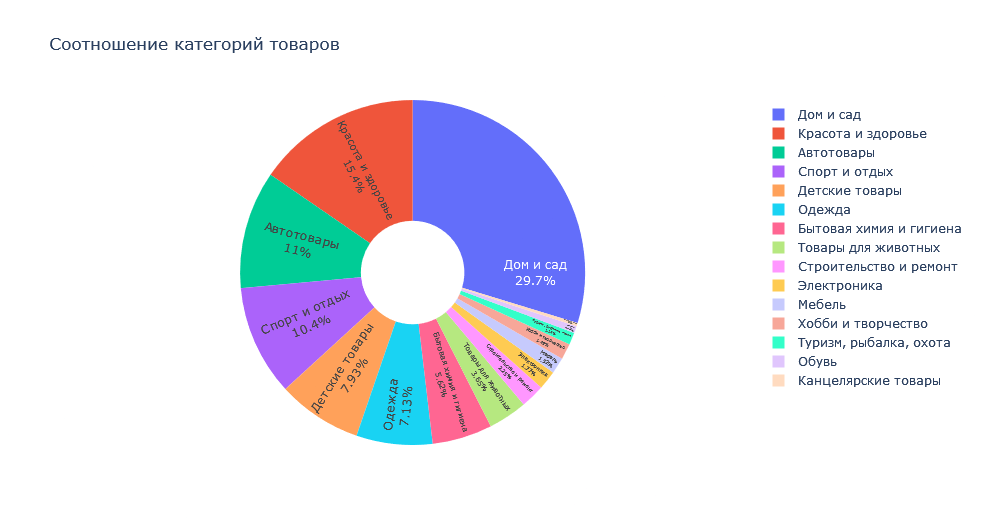

# Анализ клиентской базы e-commerce

**Цель проекта:** найти ответы на следующие бизнес-вопросы:

1. Как распределены клиенты маркетплейса по регионам России и городам?
2. Какие товары являются самыми популярными на платформе?
3. Какие категории товаров наиболее востребованы?
4. Какие товары пользуются наибольшим спросом в каждой категории?
5. Каковы средние затраты и количество покупок у клиентов в зависимости от пола и возрастной группы?
6. Каковы средние затраты и количество покупок клиентов в зависимости от категорий товаров и пола?
7. Каковы средние затраты и количество покупок клиентов в зависимости от категорий товаров и возрастных групп?
8. Как меняется количество покупок в топ-5 категориях товаров в разрезе месяцев?

**Задачи проекта:**

1. Подготовить среду.
2. Провести EDA.
3. Предобработать и очистить данные от ошибок, дубликатов.
4. Сформулировать понятия для трактовки спорных моментов в данных.
5. Проанализировать данные:
<!--  -->
5.1. Провести категорийный анализ и выявить:
- соотношение категорий товаров.
- среднюю стоимость товаров по категориям.

<!--  -->
5.2. Провести анализ поведения клиентов и выявить:
- географию клиентов маркетплейса в разрезе субъектов РФ.
- географию клиентов маркетплейса в разрезе городов.

<!--  -->

- топ-10 самых популярных товаров.
- топ-5 самых популярных категорий товаров.
- самые популярные товары по категориям.

<!--  -->
- средние затраты клиентов в разрезе полов.
- количество покупок в разрезе полов.

<!--  -->
- средние затраты клиентов в разрезе возрастных групп.
- количество покупок в разрезе возрастных групп.

<!--  -->
- средние затраты клиентов в разрезе категорий и пола.
- количество покупок в разрезе категорий и пола.

<!--  -->
- средние затраты клиентов в разрезе категорий и возрастных групп.
- количество покупок в разрезе категорий и возрастных групп.

<!--  -->
- динамику количества покупок в топ-5 категориях в разрезе месяцев.

<!--  -->
6. Сформулировать выводы.

**Шаги:**
1. Считала данные с excel файла.
2. Провела EDA и предобработку данных, очистила данные от дубликатов и ошибок.
3. Сформулировала понятия для трактовки спорных моментов в данных.
4. Провела анализ данных, в т.ч. категорийный анализ и анализ поведения клиентов.
5. Сформулировала выводы.

**Результаты:**
1. Так как большая часть клиентов сосредоточены в г. Москва, у маркетплейса пока нет необходимости направлять маркетинговые усилия на города в Московской области.
2. Выявлены топ-10 самых популярных товаров. Следовательно, маркетплейсу необходимо сосредоточить усилия на его постоянном наличии на складах и продвижении.
3. При распределении ресурсов на продвижение маркетплейсу необходимо сконцентрировать большую часть ресурсов для продвижения категорий товаров "Дом и сад", "Красота и здоровье", "Бытовая химия и гигиена", "Автотовары", "Детские товары".
4. Здесь акцентрируется внимание именно на данных 5 категориях товаров, т.к. маркетплейсу целесообразнее продвигать впервую очередь те категории товаров и товары внутри данных категорий, которые пользуются наибольшим спросом у клиентов.
5. Женщины совершают большее количество покупок, чем мужчины, но при этом их средние затраты на 14% меньше, чем у мужчин. Средние затраты клиентов и количество покупок в разрезе возрастных групп наибольшие у зрелых, куда вошли клиенты в возрасте от 31 до 59 лет. На втором месте по средним затратам и количеству покупок оказались клиенты в возрасте от 18 до 30 лет, молодежь. Поэтому при планировке маркетинговых компаний маркетплейсу необходимо таргетировать зрелых клиентов и молодежь. Так как эти две возрастные группы генерируют больше денег для бизнеса.
6. В разрезе категорий товаров и полов наибольшие средние затраты клиентов приходятся на категорию "Мебель". Топ-3 популярные категории товаров среди женщин: "Дом и сад", "Красота и здоровье", "Бытовая химия и гигиена". Топ-3 популярные категории товаров среди мужчин: "Дом и сад", "Бытовая химия и гигиена", "Строительство и ремонт". Маркетплейсу необходимо учесть данные инсайты при разработке рекомендательного алгоритма для осуществления кросс-продаж на платформе.
7. В разрезе категорий товаров и возрастных групп наибольшие средние затраты:
* зрелые (клиенты в возрасте от 31 до 59 лет) имеют в категории "Мебель";
* молодежь (клиенты в возрасте от 18 до 30 лет) имеет в категориях "Мебель" и "Одежда";
* пожилые (клиенты в возрасте 60+) имеют в категории "Товары для животных".

В разрезе категорий товаров и возрастных групп наибольшее количество покупок:
* зрелые имеют в категории "Дом и сад";
* молодежь имеет в категориях "Красота и здоровье";
* пожилые имеют в категории "Дом и сад".

Маркетплейсу необходимо учесть данные инсайты при разработке маркетинговых кампаний.

8. В топ-5 категориях спросом у клиентов в течение всего года пользуются товары категории "Дом и сад" и "Бытовая химия и гигиена". На товары категории "Красота и здоровье" пик спроса приходится на февраль. На категорию "Детские товары" пики спроса проявляются в феврале и в августе перед началом учебного года. На категорию "Автотовары" пики спроса прослеживаются в июне и декабре. Следовательно, маркетплейсу необходимо адаптировать стратегию продаж в соответствии с данными сезонными тенденциями.

**Визуализации:**

<!--  -->

<!--  -->
.png)

<!--  -->
.png)

<!--  -->
.png)

<!--  -->
.png)

<!--  -->
.png)

<!--  -->
.png)

<!--  -->
.png)

<!--  -->
.png)

<!--  -->
.png)

<!--  -->
.png)

<!--  -->
.png)

<!--  -->
.png)

<!--  -->
.png)

<!--  -->
.png)

<!--  -->
.png)

**Описание данных:**

data2022.xlsx — таблица с данными о клиентах, товарах и продавцах.

**Используемые библиотеки:**

`pandas` `plotly`

